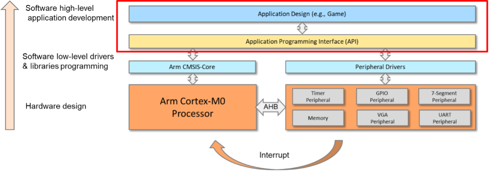
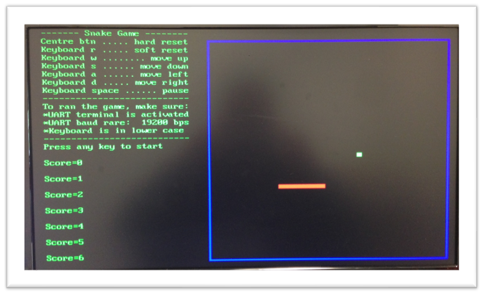

# API and Final Application

An API is developed which has more generic and easy-to-use functions. Then, based on the API, a final game application, 2 Player Snake Game, is developed.
Sleep mode is used to reduce the power consumption of the application.

* API and Application Development Hierarchy

# Results

* Graphic of output 

