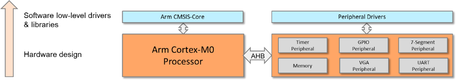

# ARM CMSIS and Software Drivers

Cortex Microcontroller Software Interface Standard (CMSIS), which is an abstraction layer for the microcontroller, and defines generic tool interfaces. It simplifies software reuse.

