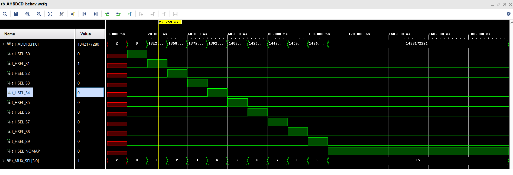

# Cortex M0 and AHB-lite Address Decoder Implementation

This lab focuses on implementing an address decoder for a System-on-Chip (SoC) on the Digilent Nexys A7 FPGA board using Xilinx Vivado. The SoC comprises an Arm Cortex-M0 microprocessor, an AHB-Lite system bus with an address decoder and multiplexer, and on-chip program memory. The Cortex-M0 DesignStart processor is written in Verilog code and is a simplified version of the standard Cortex-M0, featuring reduced interrupt capabilities. The on-chip program memory, implemented using block RAM (BRAM), stores machine code instructions for the processor. The lab consists of creating a new project in Vivado, specifying the FPGA device, and running synthesis, implementation, and bitstream generation. The tasks involve implementing the address decoder and simulating the code. The code is simulated on Xilinx Vivado and VCS.

## Results

- The waveform shows that as each HADDR increments, which is the address, and as mux select increments each select 0-9 increments as such. For example, when HMUXSEL is high HSELS1 is high when HMUXSEL goes high for select 2 HSELS2 goes high and the previous signal is deserted. This repeats for S0-S9 until HSEL_NOMAP is active low.

- This lab focuses on the design of a decoder which is used to select one of the memory locations. Each location is 16 MB and requires an address bit of 24. The decoder then utilizes the remaining 8 bits from the 32-bit address as inputs to choose amongst 10 alternative memory locations.

