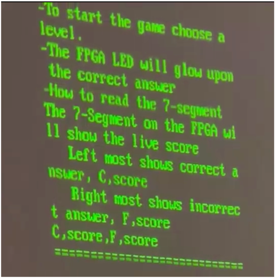
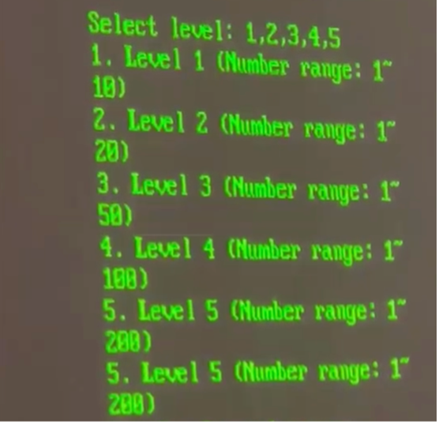
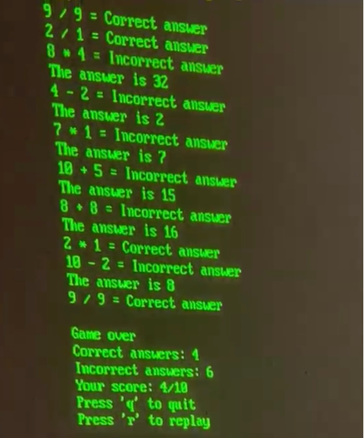
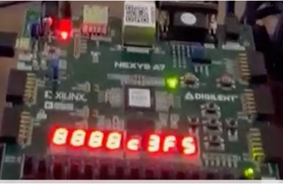

# Arithmetic Game

Mathematics is a fundamental aspect which is used everywhere. Ranging from its use in day-to-day life to complex science. The knowledge of math is required for many applications in the current era, ranging from finance to research.  Mental math has been proven to improve focus and concentration and possibly prevent dementia. This project aims to make a fundamental skill, fun and engaging. This game will create a sense of urgency and give a feeling of accomplishment when the user solves an arithmetic problem. The live score and LED features provide physical stimuli which keep the user engaged. 

This project aims to understand the important concepts related to FPGA and SoC. By utilizing buses and protocols that are used in the industry and also developing C and Assembly Coding skills. The FPGA that is used for this project is a Nexys-A7-100T. Protocols such as UART for serial communication, Timers for time-critical operations and synchronization, VGA for the visual interface, and interrupts are used.

---

The project structure is as follows:
- The Hardware\project_1 contains the Vivado 2022.2 project file.
- The keil_final_project_v3\keil_final_project contains the code.uvprojx project file.

This project is synthesized and ready to run with the reflash.bit

# Results

- The game rules are displayed

- The user then selects the Level / Difficulty

- Gameplay Demo

- The score is dynamically displayed on the 7 Segment in the format of Correct,Score,Fail,Score (C,3,F,5)