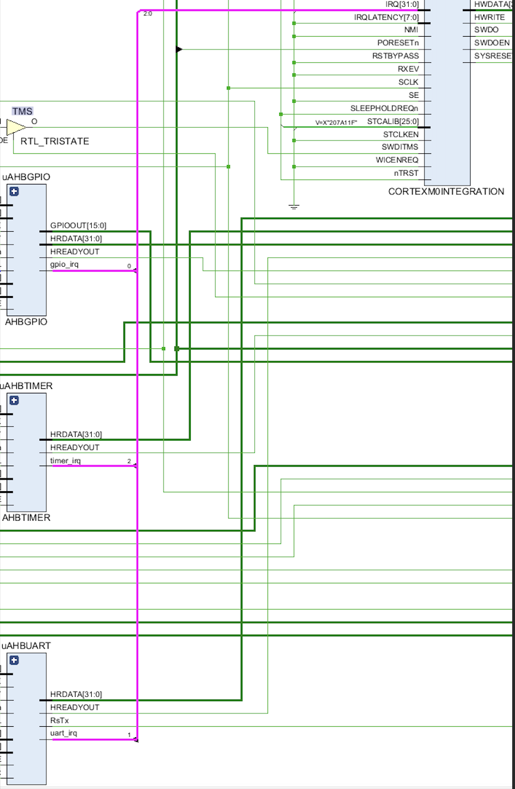

# Interrupt Mechanisms

In this lab, we will implement an interrupt mechanism for the timer and the UART peripherals.
The processor, bus interface, on-chip memory and peripheral hardware are written in Verilog.
The SoC will implement interrupt mechanisms for the AHB timer and the AHB UART.
The program targeted at the Cortex-M0 processor contains interrupt service routines for the timer and the UART peripherals.  
The result of this implementation is the switches on the FPGA act as the highest priority interrupts, when the switch is high the timer will be paused. 

# Results
The timer counts from 0 to 9, which is outputted on the VGA. If any of the switches are detected as high the timer will be pushed to a stack and it will be paused.
The interrupt service routine then services the switches. The switches will prevent both UART and timer from occurring as by design this is the most important event that is being serviced.

---

- The image shows an interrupt request signal named UART_irq tied to the receiver FIFO. The UART interrupt is different compared to the timer interrupt. The interrupt clear step can be disregarded as the interrupt will be automatically cleared after the data is read out from the FIFO.

---

**The Following files are edited:**

- Hardware &rarr; [AHBLITE_SYS.v](Hardware/project_1/project_1.srcs/sources_1/imports/FPGA/AHBLITE_SYS.v) and [AHBGPIO.v](Hardware/project_1/project_1.srcs/sources_1/imports/FPGA/previous_Lab/AHB_GPIO/AHBGPIO.v)

- Software &rarr; [cm0dsasm.s](Software/cm0dsasm.s)   

