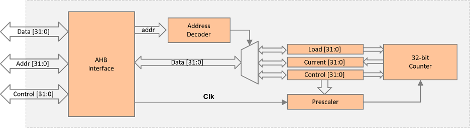

# LED, Timer, GPIO and 7-Segment Peripheral 

This lab focuses on implementing three AHB peripherals: an internal timer, a GPIO, and a 7-segment display on an FPGA. 
The lab implements both hardware design and software programming aspects. 
The hardware components include an Arm Cortex-M0 microprocessor, an AHB-Lite system bus, and the aforementioned peripherals. 
In software, tasks involve modifying and compiling assembly code to initialize and interact with the peripherals. 
This includes initializing the interrupt vector, configuring and starting the timer, displaying timer values on the 7-segment display, and testing GPIO functionality. 
The learning objectives are revolved around modifying the assembly code.

# Results

- The use of LED and switches has been done with the GPIO interfacing with the AHB lite bus which in turn allows communication with the CPU.

---

- The implementation of the timer peripheral.
  The block diagram shows the AHB interface with the Data, Addr and Control lines.
  The timer has two aspects to it, a 32-bit counter and a prescaler.
  The pre-scaler takes input from the CLK that comes from the AHB interface and also takes input either from load, current or control and with this it feeds the 32-bit counter.
  The prescaler allows the clock source to be split. If the prescaler is set to 80 an 80 MHz clock would get transformed to a 1 MHz signal. 

