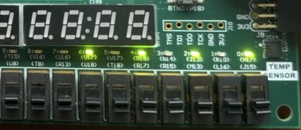
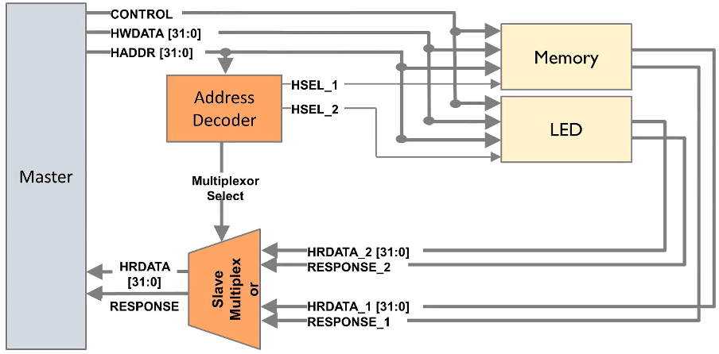

# Cortex M0 and AHB-lite Implementation

This lab focuses on implementing on-chip memory and an LED peripheral. The processor and peripherals are integrated using the AHB-Lite bus interconnect and the assembly programs are modified using ARM Keil Uvision. The processor, Cortex-M0, bus interface, AHB Lite, on-chip memory and peripheral hardware are written in Verilog using Xilinx Vivado. The design is verified, synthesized, and implemented on the Nexys A7 FPGA board.

# Results

- The LEDs activate when a button on FPGA is pressed. The generated hex files are for different assembly code outputs such as masked input/output, all on or off, and with a different pattern.

---

- The on-chip memory is used to hold the code and data. An area is reserved for a stack, a memory type in which the processor Pushes data as a store function and it uses Pop to recover or push out the data. In order to program a processor the code has to be converted or compiled into machine code. This is the set of instructions that the processor will follow. The Control signal chooses the Memory and LED and the HWDATA and HADDR are used to write to the respective manager.
