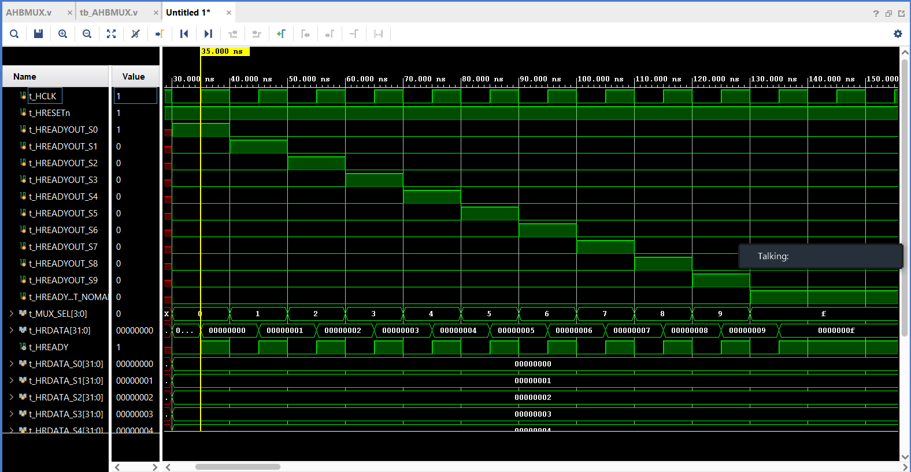

# Cortex M0 and AHB-lite Multiplexer Implementation

This lab focuses on implementing a Multiplexer Implementation using Xilinx Vivado. Multiplexers manage data and address buses within a processor, allowing the selection of data from various sources. A multiplexer is a group of logic gates used to fetch data from memory at a given memory address. A multiplexer has one or more control lines to select the data source, also called a Selector. The output of a multiplexer is the selected data. With N multiplexers (2N inputs, N selectors) we can fetch data from 2N memory locations.

# Results

- The waveform shows that as each t_MUX_sel increases, the respective t_HRDATA_Sx and t_HREADYOUT_Sx increament. This increases until 0-9 and 10 (f) at which point the default case is activated which points to the NOMAP data.

---

- The AHB Protocol consists of various fundamental elements, including Manager, Subordinate, Decoder, and Multiplexers. The AMBA-AHB-Lite protocol is suitable for use in any AHB-compatible application. Multiplexers (MUX) control the data and address buses on a CPU. Multiplexers act as switches that allow the processor to choose data from various sources. The decoder controls the Subordinate-to-Manager multiplexer, which multiplexes the read data bus and response signals from the Subordinates to the Manager. In all AHB-Lite systems with two or more Subordinates, a single centralized multiplexer is required.
